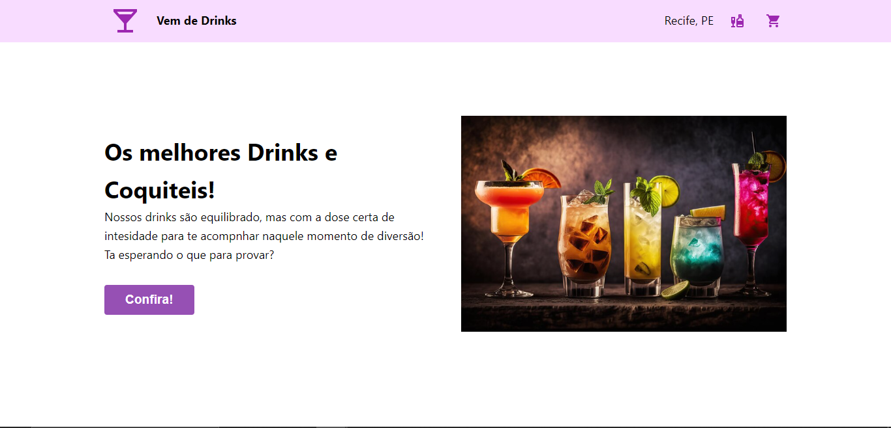

<h1 align="center">Vem de Drinks</h1>

<p align="center">
  Aplicação inspirada no projeto trabalhado em aula. O site simula um loja de venda online de drinks.
</p>
<p align="center">
  <a href="#-tecnologias">Tecnologias</a>&nbsp;&nbsp;&nbsp;|&nbsp;&nbsp;&nbsp;
  <a href="#-instalacao-do-projeto">Instalação do projeto</a>&nbsp;&nbsp;&nbsp;
</p>
<p align="center">
  
</p>

## 🚀 Tecnologias

Esse projeto foi desenvolvido com as seguintes tecnologias:

- TypeScript;
- React;
- Styled Components;
- Context API


## ⚙️ Instalação do projeto

Passo-a-passo:

1. Clone o projeto.

2. Rode o comando abaixo para instalar as dependencias:
```
npm i
```
3. Execute o projeto
```
npm run dev
```

> O projeto deve ser visualizado em um navegador padrão.